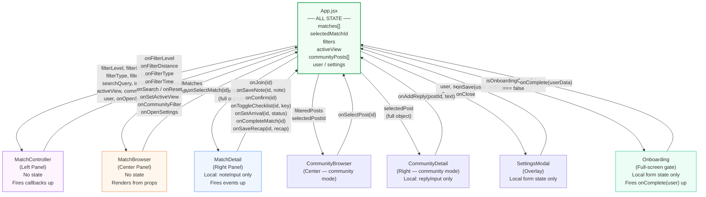

# CourtMatch — The Reactive Sandbox
**Student:** Firas Benchouikha
**Course:** AI 201, Spring 2026 — Professor Tim Lindsey
**Project:** P2 — Three-Panel React State Machine

🔗 **Live Site:** [benchouikhafiras059-maker.github.io/reactive-box](https://benchouikhafiras059-maker.github.io/reactive-box/)

---

## What This Is

CourtMatch is a local tennis match discovery platform built as a React three-panel state machine. Players can browse open matches near them, filter by NTRP level, distance, match type, and time, request to join, and track the full confirmed match experience — from request to post-match recap.

The architecture follows a strict rule: **App.jsx owns all state. Props go down. Events go up.** No Redux, no Context, no routing, no backend.

---

## Design Intent

### Domain Choice
I chose tennis match discovery because finding a quality hitting partner at the right skill level is a genuinely unsolved problem. Most platforms are built around booking coaches — not connecting players. CourtMatch solves a real gap: open a feed, filter to your level and schedule, read the match details, and decide to join. The domain gave me a rich enough data model to demonstrate meaningful state interactions without needing a backend.

I rejected more complex domains (healthcare, enterprise dashboards) because they pushed complexity into the data rather than into the interactions. Tennis is something I actually care about, which made the design decisions feel real.

### State Shape
All shared state lives in one object owned by `App.jsx`. No panel manages its own copy.

```json
{
  "isOnboardingComplete": false,
  "user": { "name": "", "zip": "", "level": "" },
  "settings": { "notification": "app", "radius": "5" },
  "activeView": "matches",
  "selectedMatchId": "match-1",
  "filterLevel": "all",
  "filterDistance": "any",
  "filterType": "all",
  "filterTime": "any",
  "searchQuery": "",
  "communityFilter": "all",
  "selectedPostId": null,
  "isSettingsOpen": false,
  "matches": [
    {
      "id": "match-1",
      "title": "Competitive Singles Hit",
      "level": "4.0",
      "status": "Open",
      "requestStatus": "none",
      "checklist": { "water": false, "balls": false, "warmup": false, "arrival": false, "address": false },
      "arrivalStatus": "none",
      "recap": null,
      "hostNote": null
    }
  ],
  "communityPosts": [
    {
      "id": "post-1",
      "author": "Marcus T.",
      "category": "Hitting Requests",
      "replies": []
    }
  ]
}
```

### Three Panel Responsibilities

| Panel | Reads | Writes |
|---|---|---|
| **Controller** (left) | All filter values, activeView, communityFilter, user | Fires filter callbacks, view switch, settings open — all up to App |
| **Browser** (center) | Pre-filtered matches or posts, selectedMatchId/postId | Fires onSelectMatch / onSelectPost up to App |
| **Detail** (right) | Full resolved selectedMatch or selectedPost | Fires onJoin, onSaveNote, onConfirm, onToggleChecklist, onSetArrival, onCompleteMatch, onSaveRecap, onAddReply |

### Visual Mood
Warm white (`#F8F6F3`) background. Tennis green (`#16A34A`) as the primary accent. Manrope typeface — clean and modern. Cards are soft and rounded. The feeling is a friendly local sports app, not a startup dashboard or dark-mode product. No dense data tables. No dark mode.

---

## Architecture Diagram



---

## Build Log — What Was Asked, Produced, and Decided

### Entry 1 — Initial CourtMatch Build
**Asked:** Build a three-panel tennis match discovery app. App.jsx owns all state. Eight matches with level, type, distance, time, host, and description. Four filter groups in the Controller. Browser shows cards. Detail shows full match info and a join button.

**Produced:** Full working app — App.jsx with `INITIAL_MATCHES`, `filteredMatches` derived state, all callbacks. MatchBrowser with status badges and hover CSS-only. MatchDetail with level, type, info grid, description, and join button. MatchController with pill filters and reset. App.css with warm white palette, tennis green accents, Manrope font.

**Decided:** Accepted entirely. The architecture matched my Design Intent exactly — App owns state, children receive props, events fire up. Status badge colors, card hover, and pill filter style were all approved without changes.

---

### Entry 2 — Enhancement Round (Sync Bar + Rich Detail + Animations)
**Asked:** Make the app feel alive. Add a sync status bar that shows when state changes. Make the Detail panel richer — court surface, intensity, play style, what to bring, match notes. Add a progress stepper when a request is sent. Add a note-to-host input. Add CSS animations throughout.

**Produced:** Sync bar with pulsing dot and auto-clear via `useRef`. DetailContent inner component with `key={selectedMatch.id}` trick for remount-on-change. Two info grids in Detail (core + extended). Progress stepper with active-step pulse animation. Note input with local state that fires `onSaveNote` up to App. Note badge in Browser card from App state. Keyframes: `detailFadeIn`, `selectedGlow`, `stepPulse`, `pulseDot`, `fadeSlideIn`.

**Decided:** Accepted. The `key` trick was exactly what I needed — it resets local state AND replays CSS animations in one move without any JS timer. The stepper animation (pulsing circle on the active step) made the "pending" state feel real.

---

### Entry 3 — Onboarding Flow
**Asked:** Add a lightweight onboarding flow before the main app. Two screens: welcome with feature bullets, then a form for name, ZIP code, and skill level. When complete, store user in App state and optionally pre-filter matches to their NTRP level.

**Produced:** `Onboarding.jsx` with two screens gated by local `screen` state. Screen 1: welcome, icon, feature bullets, Get Started button. Screen 2: name input, ZIP input, level pills (Beginner/Intermediate/Advanced + NTRP 3.0–5.0), Start Finding Matches button. `key` on each screen div replays `obFadeIn` animation on transition. Fires `onComplete(userData)` up to App. App stores user, flips `isOnboardingComplete`, shows welcome toast, pre-filters if NTRP level selected.

**Decided:** Accepted with one note — the onboarding screens needed to feel warmer, not like a sign-up form. The icon size, generous padding, and `obFadeIn` animation already handled that, so no revision was needed.

---

### Entry 4 — Community Hub + Settings
**Asked:** Add a Community tab to the left panel that switches the Browser and Detail to show community posts (hitting requests, doubles lookups, tournament talk, SCAD posts). Add a profile strip at the bottom of the Controller with name, level, ZIP, and a settings gear. Add a Settings modal for editing profile and preferences.

**Produced:** `activeView` state in App (`'matches' | 'community'`) gates which Browser and Detail render. `CommunityBrowser.jsx` — post cards with category badge, message preview, reply count. `CommunityDetail.jsx` — full post, author avatar (initials), reply thread, reply input with `key` trick. `SettingsModal.jsx` — modal overlay, local form state initialized from props, fires `onSave(updatedUser, updatedSettings)` up. View toggle in MatchController with `view-toggle__btn` + `view-toggle__btn--active`. Profile strip with sticky positioning via `ctrl-wrap` flex layout.

**Decided:** Accepted. The `ctrl-wrap` flex trick (controller scrolls, profile strip sticks to bottom via `flex-shrink: 0`) was cleaner than any JS-based approach I would have reached for.

---

### Entry 5 — Confirmed Match Experience
**Asked:** When `requestStatus === 'confirmed'`, transform the Detail panel from request mode into a Match Plan. Add: confirmation header with green badge, match plan card (court, surface, format, intensity, what to bring), prep checklist (5 checkable items stored in App state), arrival status buttons (on my way / arrived / cancel), and a Complete Match button that leads to a post-match recap form.

**Produced:** `requestStatus` field on each match (`'none' | 'confirmed' | 'completed'`). `MatchContent` component that gates which view renders. `ConfirmedView` with green header, plan card, prep checklist (each item fires `onToggleChecklist(id, key)` up to App), arrival buttons (fire `onSetArrival(id, status)` up), complete button. `CompletedView` with purple header, result input, reflections textarea, save recap. Browser card updated: green left border on confirmed, purple on completed, prep progress badge (`3/5 prep`), arrival badge (`🚗 On my way`), recap badge. Simulate button below stepper (dashed border, clearly labeled) so the confirmed flow is demonstrable in a frontend-only context.

**Decided:** Accepted. Storing `checklist{}`, `arrivalStatus`, and `recap` directly in the match object was the right call — it meant Browser and Detail both updated from the same data source with no sync logic needed.

---

## Documented Rejections & Revisions

### Rejection 1 — "PUMA Shoe Explorer" → Tennis Match Discovery
**What AI named it:** PUMA Shoe Explorer — a product browsing interface for PUMA shoes (Speedcat OG, MB.04, Deviate NITRO 3, Palermo) with category filtering and a dark editorial aesthetic.

**What I chose instead:** Tennis match discovery — CourtMatch.

**Why:** The shoe explorer was a product page, not a state machine. Selecting a shoe and reading its specs is a one-way interaction — there was no meaningful state that changed based on user action beyond `selectedShoeId`. CourtMatch gave me multi-dimensional filters, real status changes (Open → Request Sent → Confirmed → Completed), checklist state, arrival state, and a community layer — all of which required genuine state management decisions. The shoe project would have passed the architecture audit but not demonstrated anything interesting. I also realized I was building it to connect to a PUMA client project rather than to learn React state, which was the wrong reason.

---

### Rejection 2 — "MedDash" (Healthcare Operations Dashboard) → Back to Tennis
**What AI named it:** MedDash — a healthcare patient monitoring dashboard with four patients (Curtis Valk, Maria Santos, James Okafor, Amara Diallo), five data layer views (Overview, Diagnostics, Imaging, Records, Monitoring), inline SVG sparklines, and a clinical white/blue palette.

**What I chose instead:** Stayed with CourtMatch — the tennis match discovery platform.

**Why:** The healthcare domain produced visually impressive output but the interactions felt fake. Switching between "Diagnostics" and "Imaging" tabs for a fictional patient is not meaningful state — it is a tab switcher with static JSON. More importantly, I had no personal connection to healthcare data design. Every decision I made was guessing what a clinician might need, not what I actually understood. With tennis I knew the domain — what level filtering means, why distance matters, what the difference between "Filling Fast" and "Full" communicates to a real player. Design decisions made from real understanding produce better work than design decisions made from imitation.

---

### Rejection 3 — Dark Navy Aesthetic → Warm White
**What AI produced:** A dark navy (`#0D1117`) interface with `#2ECC71` tennis green accents, FF DIN Condensed Bold headings, and a sports/dev dashboard visual tone — similar to a GitHub or Vercel dark mode product.

**What I chose instead:** Warm white (`#F8F6F3`), tennis green (`#16A34A`), clay accent (`#EA7C3F`), Manrope typeface, rounded cards with soft shadows.

**Why:** The dark navy app looked like a developer tool, not a local sports platform. CourtMatch is supposed to feel like something you'd open on your phone on a Saturday morning before heading to the courts — friendly, readable in sunlight, approachable to a 3.0 beginner and a 5.0 competitive player alike. Dark mode creates visual hierarchy through contrast, which works for dense data products. CourtMatch is not a dense data product — it is a discovery interface. Warm white with generous whitespace communicates openness and ease. The clay accent (borrowed from clay court surfaces) grounded the palette in the actual sport. The dark version felt like I was trying to make tennis look cool. The warm version made it actually useful.

---

## Critical Reflection

### 1. Can I defend this?
Yes — the structure and interactions are intentional and tied directly to the assignment's state-driven system.

I chose a match discovery flow because it clearly demonstrates how selecting an item (match) updates the Detail View, and how filters dynamically reshape the Browser. I can explain why state is centralized in App.jsx, how `selectedMatchId` drives the UI, and how actions like "Request to Join" or status updates propagate across all panels. Every interaction supports clarity and immediate feedback.

---

### 2. Is this mine?
Yes — the concept, feature direction, and interaction design are mine.

I defined the idea of focusing on competitive match opportunities instead of generic booking, and I designed the flow from browsing → selecting → requesting → confirmed experience. AI was used to accelerate implementation and styling, but I made decisions about:
- what features to include (filters, onboarding, request lifecycle)
- how the system behaves
- what interactions matter for the user

---

### 3. Did I verify?
Partially, and this is an area I could improve.

I verified core interactions:
- selecting a match updates the Detail View
- filters correctly update the Browser
- request states (sent, confirmed, declined) propagate across panels

However, I did not fully test edge cases (e.g., empty states, conflicting filters, multiple rapid interactions). If I had more time, I would test more scenarios and refine transitions to ensure consistency under all conditions.

---

### 4. Would I teach this?
Yes — I understand the system well enough to explain both the design and the React architecture.

I can teach:
- how single source of truth works in App.jsx
- how props down / events up connects the three panels
- how user actions (click, filter, request) update shared state
- how UI feedback (status badges, detail updates) is driven by state changes

I can also explain the UX decisions behind simplifying the flow to focus on discovery and selection.

---

### 5. Is my documentation honest?
Yes — I documented how I used AI to assist with building components, styling, and structuring the code, and where I made changes.

However, I recognize that my earlier reflections were too superficial. In this version, I clarified:
- what decisions were mine
- how AI contributed
- what I verified vs. what I did not fully test

This documentation more accurately reflects my process and understanding of the project.

---

## How to Run

```bash
npm install
npm run dev
```

Then open the URL shown in the terminal (usually `http://localhost:5173`).

---

*AI 201 — Spring 2026 | Professor Tim Lindsey | SCAD*
